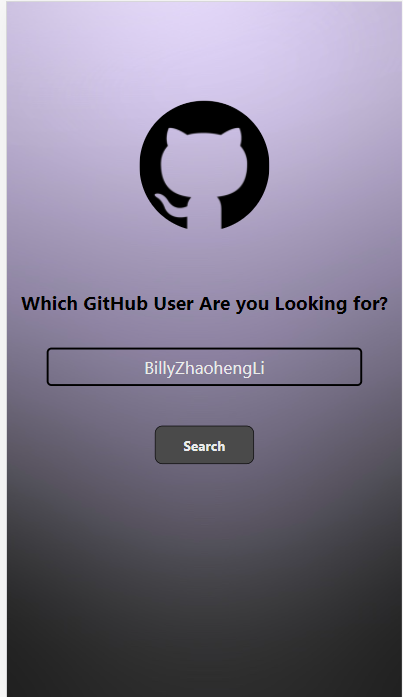
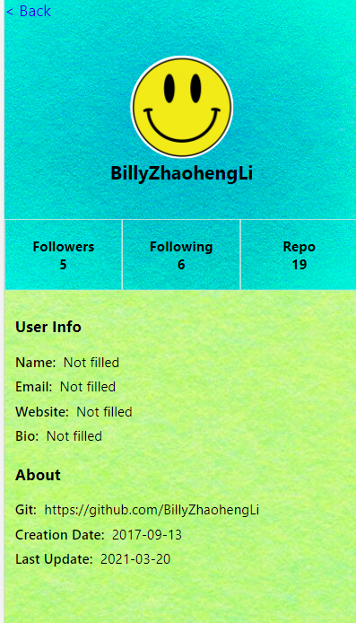
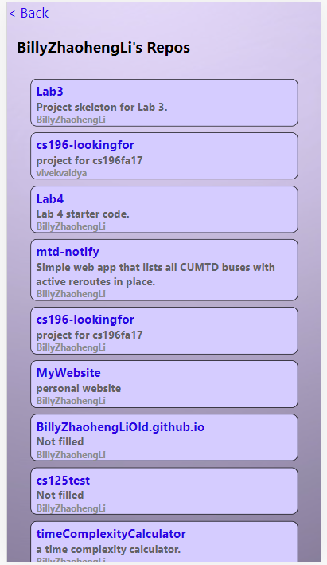
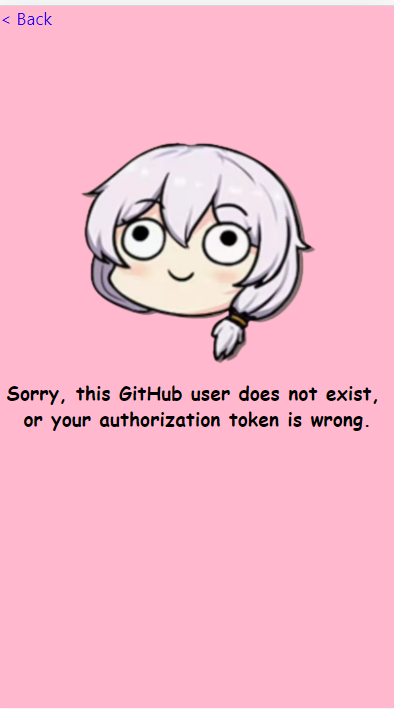
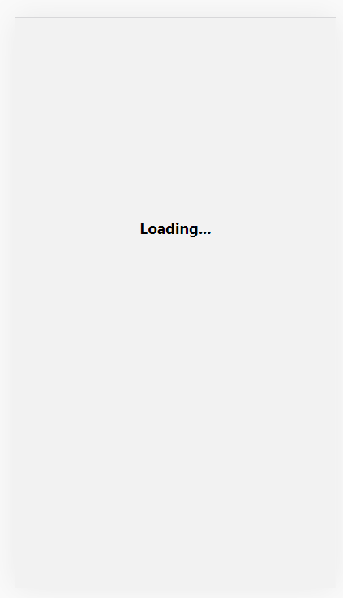
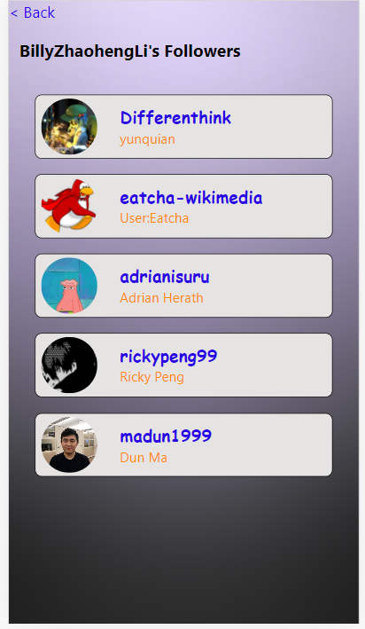
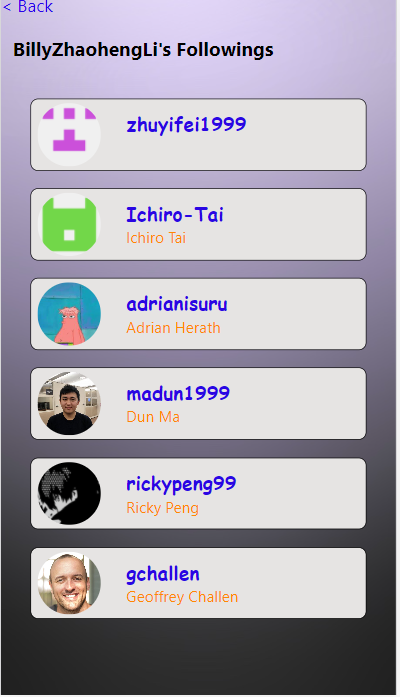

# sp21-cs242-assignment3

## Introduction

This is the assignment-3 for CS242@UIUC, SP 21. It implements a github account visualizer on mobile platforms (Andriod, ios) using react native.

Thanks to Github's GraphQL API, we are able to fetch user data based on their github logins id (or github user names). This project focues on providing front-end support for better user experience.

### Part 1

In assignment-3.0, the following screens, as well as navigation between them, are implemented:

- Home screen (starting page, with an input box for target user)
- Loading screen (loading prompt for when data are being fetched from graphQL.)
- Profile screen (major page of the app, containing micellenious user information. With the {follower, following, repo} touchable opacities, app users can navigte to the queried account's additional infomation.)
- Repo Screen (Listing all queried user's  public repositories.)
- Empty Screen (When no search results are available, this should be shown).

### Part 2

In assignment-3.1 the following screens or functinalities are implemented.

- Follower Screen / Following Screen, in which related users' avatars, user logins, user names will be visible.
- Upon clicking on the user division discribed above, page will be navigated to corresponding related user's profile page. (Loading screen for the time gap of data fetching will also be implemented)
- Implement "back" button for flexibly navigate back and forth.
- Add navigation on repo screen.
- Add mock testing for follower, following, repo snapshot test. Develop testcases with coverage of common cases and error cases (network error, authorization error, invalid query).
- Add mock function for  navigation buttons so as to test the functionality of navigation.


## Requirements

```


    "@react-native-community/masked-view": "^0.1.10",
    "@react-navigation/native": "^5.9.3",
    "@react-navigation/stack": "^5.14.3",
    "babel-eslint": "^10.1.0",
    "eslint-plugin-jest": "^24.3.2",
    "expo": "~40.0.0",
    "expo-splash-screen": "~0.8.0",
    "expo-status-bar": "~1.0.3",
    "expo-updates": "~0.4.0",
    "node-fetch": "^2.6.1",
    "prop-types": "^15.7.2",
    "react": "16.13.1",
    "react-dom": "16.13.1",
    "react-native": "~0.63.4",
    "react-native-dotenv": "^2.5.3",
    "react-native-gesture-handler": "^1.8.0",
    "react-native-reanimated": "^1.13.2",
    "react-native-safe-area-context": "^3.2.0",
    "react-native-screens": "^2.15.2",
    "react-native-unimodules": "~0.12.0",
    "react-native-web": "~0.13.12",
    "standard": "^16.0.3"
  },
  "devDependencies": {
    "@babel/core": "~7.9.0",
    "babel-jest": "~25.2.6",
    "eslint": "^7.22.0",
    "eslint-config-airbnb": "^18.2.1",
    "eslint-plugin-import": "^2.22.1",
    "eslint-plugin-jsx-a11y": "^6.4.1",
    "eslint-plugin-react": "^7.22.0",
    "eslint-plugin-react-hooks": "^4.2.0",
    "jest": "^25.2.7",
    "jest-fetch-mock": "^3.0.3",
    "react-test-renderer": "~16.13.1"
```

OS: Windows.

Browser: Chrome 89.x

Notice this is the native environment where this app is initially developed - they are not intended to be hard requirements.

## GUI View

### Home Screen



### Profile Screen



### Repo Screen



### Empty Screen



### Loading Screen




## Following/Follower Screens





